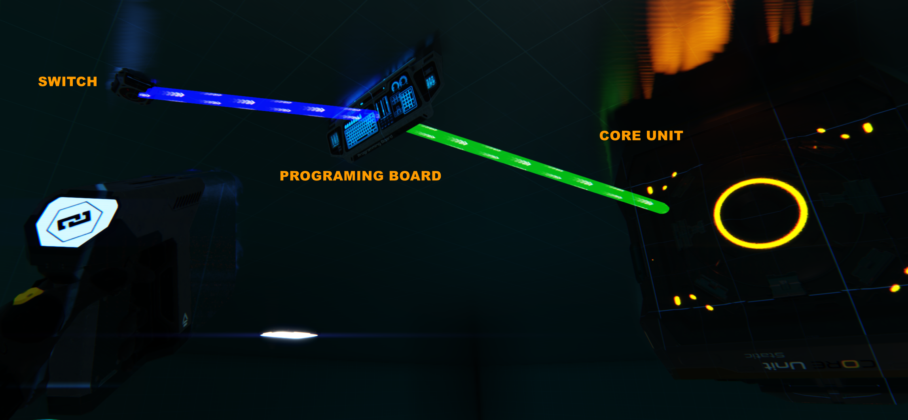
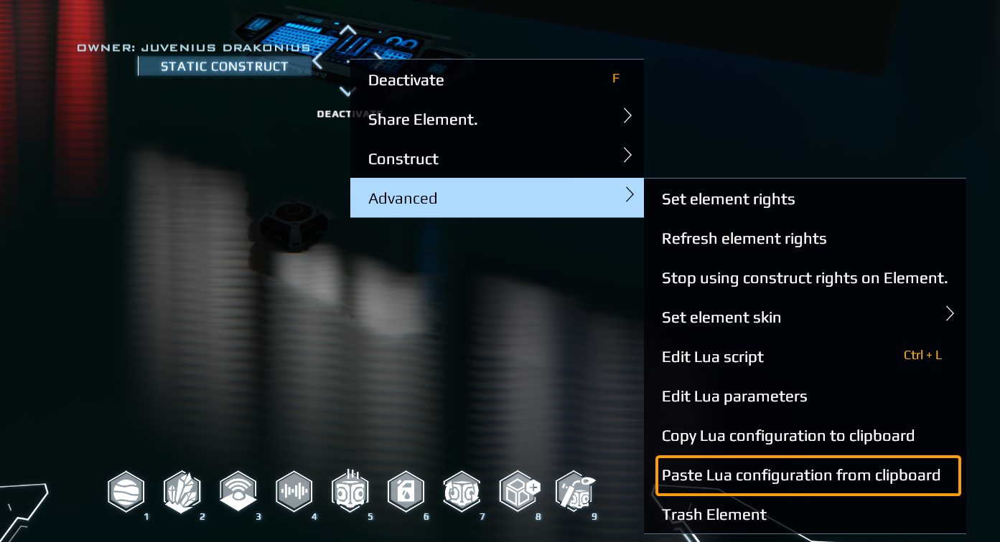
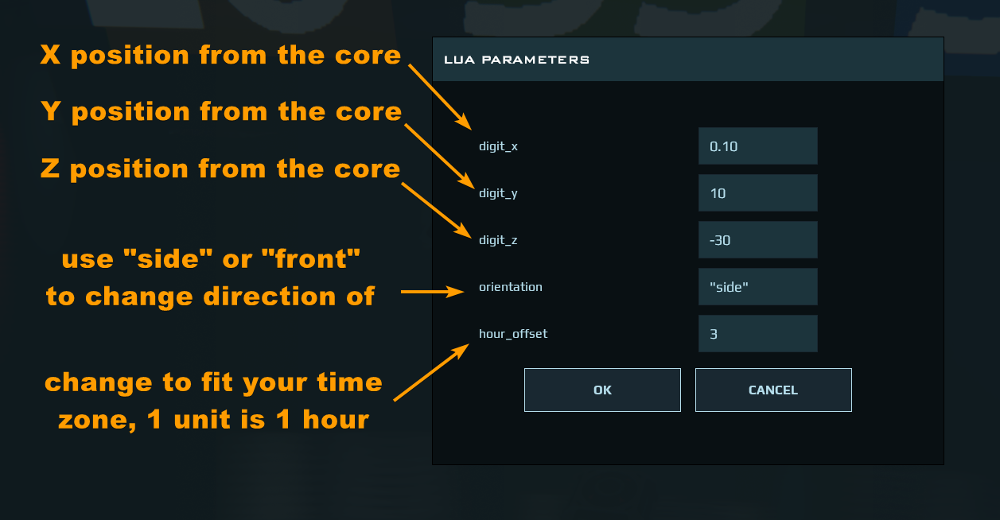

# Dual Universe Floating Clock

This clock does not uses screens or signs to display time but a method of floating number stickers that change over time.

## How it works

The clock activates when the Programing Board is activated, you can use a switch to turn it on and off or any element that can turn on and off the PB. The clock will apear floating and with the LUA Parameters you can change the orientation of the digits. Just switch it on and off, nothing more to do.

## Instalation

**Elements needed**

Basic:

- Core Unit (any size or model)
- Programing Board

Optional:

- Switch - optional

**Build**

Basic:

- Place the core unitm if you dont have one available
- Place the programing board near the core unit
- Use the link tool and link the programing board to the core unit

Optional

- Place the switch or activating element near the programing board
- Link the switch to the programing board, again...SWITCH TO Programing Board, not the other way arround.

*IMPORTANT: If you want to use a switch pay atention on the link setup of it. Link FROM the Switch TO THE Programing board (PB), this way the switch will turn on and off the board, if you do it the other way arround the PB will*

**Link diagram**
switch -->Programing Board--> Core Unit

## Loading the LUA

- Simplest: Open 'juvenius_clock_config.lua' on any text editor and Copy all and pase it in the element (see figure2 for the place on the menu),
- Lua savvy: Open 'juvenius_clock.lua', follow the comments and place the code on the right slots and filters. Take atention on the name of the core, as the core uses 'core' for value of the construct core's link name.

## Parameters

- digit_x, digit_y , digit_z : Move the clock on the core's [ x | y | z ] axis, one unit is 1 meter from the center of the construct
- orientation : Change the orientation of the clock, only 2 options "side" or "front" what ever works best
- hour_offset : Offset the hour to fit time zone needs, 1 unit equals 1 hour you can use decimals 4.5 = 4 hours and 30 minutes

## Planded Upgrades

- Stop Watch, Timer, Alarm functions
- Rotate the digits on any direction
